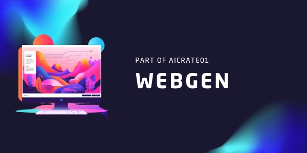

# AI Webpage Generator

A web-based tool that generates custom webpage code using Google's Gemini AI. Users can specify their preferred CSS framework, page type, components, JavaScript features, and color palette to generate tailored webpage code.

## Features

- Support for multiple CSS frameworks (Bootstrap, Tailwind CSS, or custom CSS)
- Various page type templates (Landing Page, Portfolio, Business Site)
- Customizable components (Header, Footer)
- JavaScript feature integration (Responsive Navigation, Dark Mode)
- Pre-defined color palettes
- Real-time code generation
- Code preview and download functionality

## Prerequisites

- Python 3.9.18
- Flask
- Google Generative AI API key

## Installation

1. Clone the repository:
2. Create and activate a virtual environment
3. Install dependencies
4. Create a `.env` file in the root directory and add your Gemini API key

## Usage

1. Start the Flask development server

2. Open your browser and navigate to `http://localhost:5000`

3. Fill out the form with your desired webpage specifications:
   - Select a CSS framework
   - Choose a page type
   - Select desired components
   - Enable JavaScript features
   - Pick a color palette

4. Click "Generate Webpage" to create your custom webpage code

5. Use the "Download Files" button to save the generated code

## Deployment

The application is configured for deployment on platforms like Heroku using Gunicorn. The necessary configuration files (`Procfile` and `runtime.txt`) are included.

## Contributing

Contributions are welcome! Please feel free to submit a Pull Request.

## License

This project is licensed under the MIT License - see the [LICENSE](LICENSE) file for details.